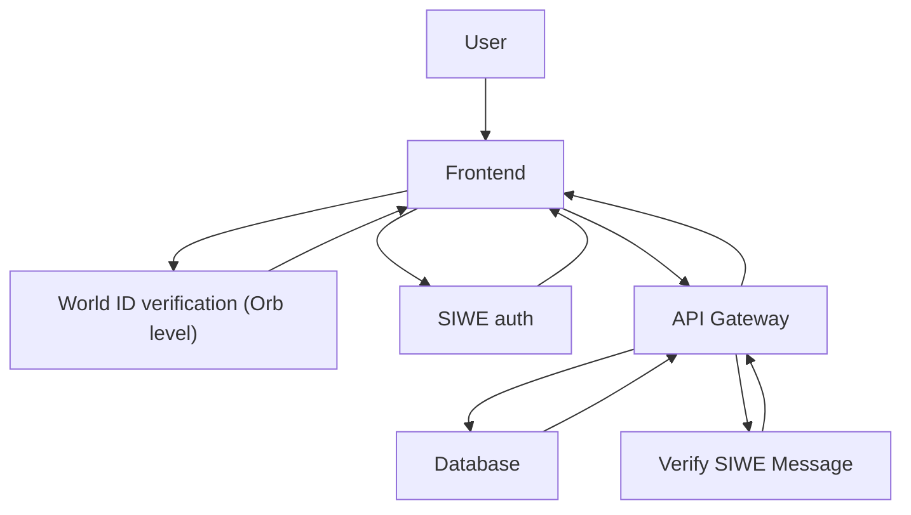

# 50x15 Frontend Documentation

## Project Overview

### Purpose:

50x15 es una experiencia de trivia rápida con identidades verificadas que permite participar en salas con bote, preguntas cronometradas y premios liquidados en cadena.

50x15 utiliza verificaciones con World ID y flujo de pagos para asegurar que las respuestas y el reparto del bote sean confiables y auditable.

### Key Features:

* Poll creation and management with real-time updates
* Secure, tamper-proof voting powered by World ID verification
* Transparent results visualization with community insights
* Decentralized identity verification through World ID
* SWIE authentication
* Expressive voting capabilities via **Quadratic Voting (QV)**

### Live Links:

* **Production:** [worldview.fyi](https://www.worldview.fyi)
* **Staging:** [staging.worldview.fyi](https://staging.worldview.fyi)

---

## Architecture Overview

### System Diagram:



### Tech Stack:

* **Frontend:** React, Next.js, TailwindCSS
* **[Backend](https://github.com/GeneralMagicio/worldview-be):** Node.js, NestJS (API endpoints)
* **Blockchain Integration:** Worldcoin MiniKit-JS
* **State Management:** React Query (Asynchronous data fetching).
* **Forms Managment:** React Hook Form
* **Deployment:** Vercel

### Data Flow:

1. User interaction triggers API calls.
2. Data is processed through backend services and blockchain interactions.
3. Responses are rendered dynamically in the frontend views.

---

## Getting Started

### Prerequisites:

* Node.js >= 20.x
* npm >= 10.x

### Installation Steps:

```bash
# Clone the repository
git clone https://github.com/username/worldview-fe.git

# Navigate into the project directory
cd worldview-fe

# Install dependencies
yarn install
```

### Configuration:

* Create a `.env` file in the root directory:

```env
APP_ID=your_app_id

NEXT_PUBLIC_APP_ID=your_app_id
NEXT_PUBLIC_APP_URL=your_frontend_app_url
NEXT_PUBLIC_BACKEND_URL=your_backend_app_url #staging (https://backend.staging.worldview.fyi)
```

---

## Usage Instructions

### Running the Application:

* **Development Mode:**

```bash
yarn dev
```

* **Production Mode:**

```bash
yarn run build && yarn start
```

## Deployment Process

### Environments:

* **Development:** Local Docker containers
* **Staging:** Vercel
* **Production:** Vercel

## Troubleshooting

### Common Issues:

1. `API not responding:` Verify `.env` variables are correctly configured.

2. User verification not proceeding
- Possible Cause: The "Verify" action has not been created or configured correctly in your Worldcoin App Dev Portal.
- Resolution:
    - Navigate to your Worldcoin Dev Portal and make sure you're on the exact app.
    - Go to Incognito Actions → Create Action.    
    - Set the following values:
       - Action Name: verify
       - Max Verifications per User: Unlimited
    - Click Save Changes to confirm.
    - After saving, try the verification process again. The action should now proceed as expected.


### Logs and Debugging:

* Access Vercel logs for production diagnostics.

---

## Contribution Guidelines

### Code Standards:

* **Reusable Icon Components:**
  All icons should be created as reusable components under /components/icon-components. This ensures consistency across the application and improves maintainability.

* **Data Fetching and Mutations:**
  Use React Query hooks (useQuery, useMutation) for all data fetching and mutations. This approach optimizes data synchronization, caching, and error handling.

* **Type Safety with TypeScript:**
  Ensure all components, hooks, and services are strongly typed using TypeScript to prevent runtime errors and improve code reliability.

### Branching Strategy:

* Main branch: `main`
* Staging branch: `staging`
* Development branch: Feature integration branch

### Pull Request Process:

1. Fork the repository
2. Create a new feature branch
3. Open a pull request for review

---

## Additional Resources

### Documentation Links:

* [Worldcoin MiniKit-JS Documentation](https://docs.world.org/mini-apps/quick-start/installing).
* [World Mini Apps Documentation](https://docs.world.org/mini-apps).
* Next.js Official Documentation.

### Contact Information:

* Maintainers: @Meriem-BM, @RamRamez

### Acknowledgments:

Thanks to all contributors and the Worldcoin community for their support.